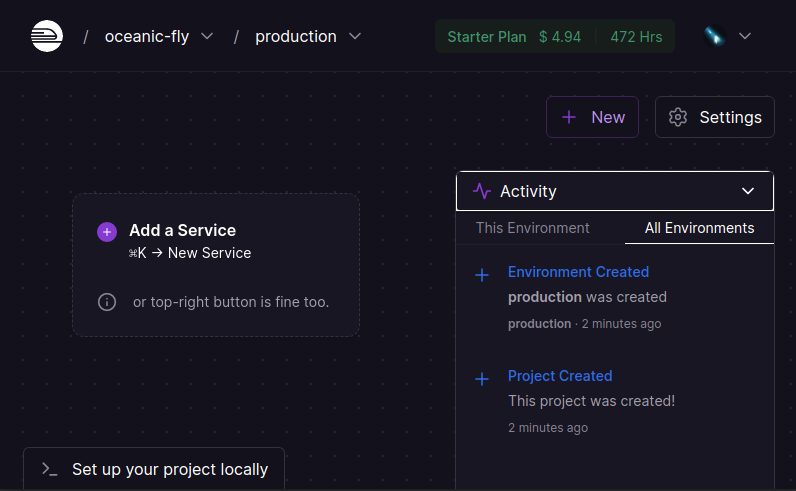
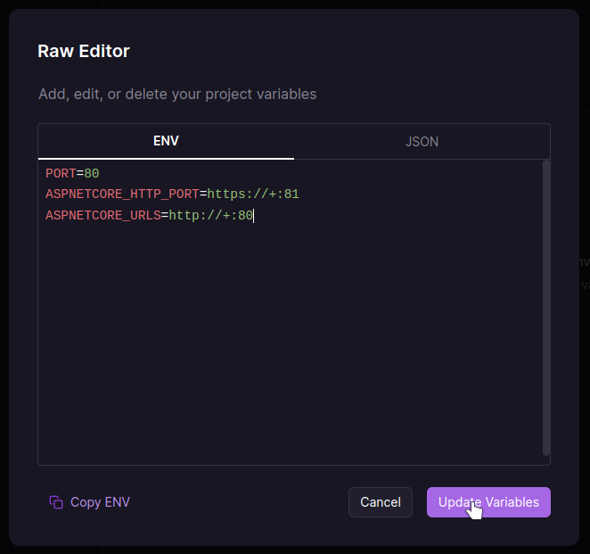
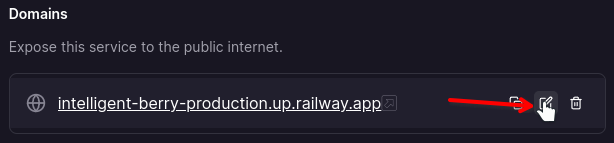

*A quick guide on how to host a blazor website on railway.app*


# 0. Prerequisites

- [Github](https://github.com) account
- [Railway.app](https://railway.app?referralCode=V3mmKK) account
- A cup of water (stay hydrated)


# 1. Prepare the C# project

For this guide we're gonna be using [docker](https://www.docker.com/), if you don't know what that is or how to use it then don't worry since it's very easy.

*Note: I'll be using my own Portfolio project as an example here*

1. Create a file in the root directory of your project and name it `Dockerfile`

2. Open the file and paste this

```docker
# Build stage
FROM mcr.microsoft.com/dotnet/sdk:7.0 AS build
WORKDIR /source
COPY . .
RUN dotnet restore "src/Portfolio/Portfolio.csproj" --disable-parallel
RUN dotnet publish "src/Portfolio/Portfolio.csproj" -c release -o /app --no-restore

# Serve stage
FROM mcr.microsoft.com/dotnet/aspnet:7.0
WORKDIR /app
COPY --from=build /app ./

ENTRYPOINT ["dotnet", "Portfolio.dll"]
```
   - Note 1: code snippet *borrowed* from [here](https://youtu.be/3s-RfwvijpY?t=206)
   - Note 2: set the .net version to the version you're using
   - Note 3: replace the csproj path to the relative path of your csproj and rename `Portfolio.dll` to the name of your csproj

3. Push your changes to github


# 2. Creating a railway project

*Their UI is a bit goofy but bear with me*

1. Go to [Railway.app](https://railway.app?referralCode=V3mmKK) and click on `Start a New Project`

2. Choose `Empty Project` and you should get a window like this


3. Click on the button in the middle `Add a service` and choose `Empty service`

4. Click on it again and a side bar should come up, here we can configure our project before deploying it

5. Click on `Variables` > `Raw Editor` and paste these in there then press `Update variables`

```sh
PORT=80
ASPNETCORE_HTTP_PORT=https://+:81
ASPNETCORE_URLS=http://+:80
```
   - these variables will allow our project to be accessible to the internet
    

6. Go to Settings and click on `Genrate Domain` (or `Custom Domain` if you own one)
   - if you did generate a domain you can rename it by clicking on the edit icon
    

7. Scroll down and give your service a fancy name

8. And finally click on `Connect Repo` and choose the project you want to host, give it a second or two to build then done your project should be ready

Now you can use the domain you set earlier to access your site


# 3. End Notes

Now that your website is ready you may want to fiddle a bit with the railway website so here are some easy things you can do:

### Dashboard

- If you click on the website's logo top left it will bring you to the dashboard page, here you can see all your projects and can make new ones.


### Project

- Each project on railway can consist of multiple apps (or services), so for example you can click on the project that contains your website then add a new database or even another website

- In a project page you can see a summary of it's activities if you click on the `Activity` tab bottom right

- You can update the project's settings if you click on the `Settings` button top right
  - In the `General` tab you can edit the project's name, description and visibility (i'd love if they give you a pop up to edit these before creating the project)
  - In the `Members` tab you can invite people to work with you on the project

### Service

- If you click on a service you can monitor it and change it's options
  - The `Deployments` tab allow you yo see the deployments you did and read the logs if you click on `View Logs`
  - The `Variables` tab allow you to configure the environment variables
  - The `Metrics` tab allow you to see your service's cpu/memory/network usage

And that's all, thanks for reading and enjoy your website :D